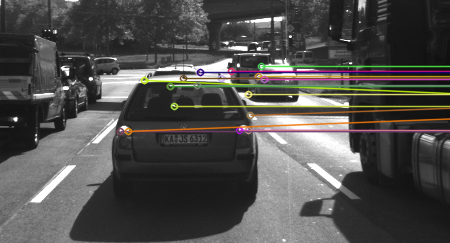
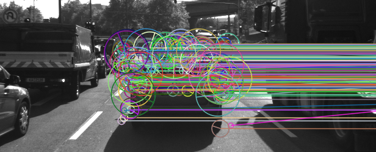
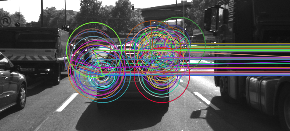
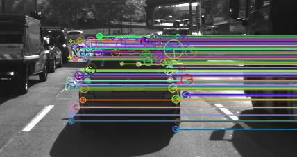
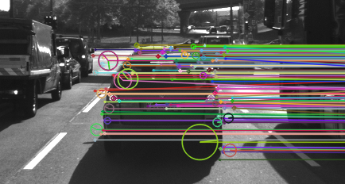

# Camera Based 2D Feature Tracking

## Part I: Solution Description
### MP.1 Data Buffer Optimization
Implements a ring buffer where new elements are added to tail and older are removed from head. And in this case, set the capacity of this buffer as 2, which represents two adjacent frame reading from sequences of traffic images. Part of a template class definition can be seen below.

```
template<typename T, unsigned int kMaxCapacity>
class RingBuffer
{
  public:
    typedef unsigned int SizeType;
    typedef T ValueType;
    typedef ValueType& Reference;
    typedef const ValueType& ConstReference;
    
    static const SizeType kCapacityLimit = kMaxCapacity;

    explicit RingBuffer(SizeType capacity = kMaxCapacity)
        :head_(0U), tail_(0U), size_(0U), capacity_(capacity)
    {
        SetMaxSize(capacity);
    }

    ~RingBuffer() {}

    // ignore concrete member functions
}
```

### MP.2 Keypoint Detection
Implement detectors HARRIS, FAST, BRISK, ORB, AKAZE, and SIFT and make them selectable by setting a string accordingly.


1. Traditional Harris detector for keypoints detection is given by this function. 
```
void detKeypointsHarris(std::vector<cv::KeyPoint> &keypoints, cv::Mat &img, bool bVis)
{
    int blockSize = 2;      // a blockSize x blockSize neighborhood for every pixel
    int apertureSize = 3;   // for sobel operator
    int minResponse = 100;  // minimum value for a corner in the 8-bit scaled response matrix
    double k = 0.04;        // Harris parameter

    cv::Mat dst, dst_norm, dst_norm_scaled;
    dst = cv::Mat::zeros(img.size(), CV_32FC1);
    cv::cornerHarris(img, dst, blockSize, apertureSize, k, cv::BORDER_DEFAULT);
    cv::normalize(dst, dst_norm, 0, 255, cv::NORM_MINMAX, CV_32FC1, cv::Mat());
    cv::convertScaleAbs(dst_norm, dst_norm_scaled);

    // look for prominent corners and keypoints
    double maxOverlap = 0.0;
    for(size_t i = 0; i < dst_norm.rows; i++)
    {
        for(size_t j = 0; j < dst_norm.cols; j++)
        {
            int response = (int)dst_norm.at<float>(i,j);
            if(response > minResponse)
            {
                // only store points above a threshold
                cv::KeyPoint newKeypoint;
                newKeypoint.pt = cv::Point2f(j, i);
                newKeypoint.size = 2*apertureSize;
                newKeypoint.response = response;

                // ignore codes below for perform non-maximal suppression
            }
        }
    }
}
```

2. The other modern detector including FAST, BRISK, ORB, AKAZE, and SIFT are given in this function below, in which a parameter called **_detectorType_** makes them selectable.
```
void detKeypointsModern(std::vector<cv::KeyPoint> &keypoints, cv::Mat &img, std::string detectorType, bool bVis)
{
    cv::Ptr<cv::FeatureDetector> detector;

    if (detectorType.compare("FAST") == 0)
    {
        int threshold = 30;     
        int bNMS = true;      
        cv::FastFeatureDetector::DetectorType type = cv::FastFeatureDetector::TYPE_9_16;
       
        detector = cv::FastFeatureDetector::create(threshold, bNMS, type);
        detector->detect(img, keypoints);
    }
    else if(detectorType.compare("BRISK") == 0)
    {
        detector = cv::BRISK::create();
        detector->detect(img, keypoints);
    }
    else if(detectorType.compare("SIFT") == 0)
    {
        detector = cv::xfeatures2d::SIFT::create();
        detector->detect(img, keypoints);
    }
    else if(detectorType.compare("ORB") == 0)
    {   
        detector = cv::ORB::create();
        detector->detect(img, keypoints);
    }
    else if(detectorType.compare("AKAZE") == 0)
    {
        detector = cv::AKAZE::create();
        detector->detect(img, keypoints);
    }

    // visualize results
    if (bVis)
    {
        cv::Mat visImage = img.clone();
        cv::drawKeypoints(img, keypoints, visImage, cv::Scalar::all(-1), cv::DrawMatchesFlags::DRAW_RICH_KEYPOINTS);
        string windowName = "Modern Detector Results";
        cv::namedWindow(windowName, 2);
        imshow(windowName, visImage);

        cv::waitKey(0);
    }
}
```

### MP.3 Keypoint Removal
To remove all keypoints outside of a pre-defined rectangle and only use the keypoints within the rectangle for further processing. A lambda expression is used to loop through all detected keypoints, and  _std::vector::erase_, _std::remove_if_, _cv::Rect::contains_ are incorporated to finish this job.

```
bool bFocusOnVehicle = true;
cv::Rect vehicleRect(535, 180, 180, 150);
if (bFocusOnVehicle)
{
    keypoints.erase(std::remove_if(keypoints.begin(), keypoints.end(), [&vehicleRect](const cv::KeyPoint &r){return !(vehicleRect.contains(r.pt));}),
                keypoints.end());
}
```

### MP.4 Keypoint Descriptors
Implements descriptors BRIEF, ORB, FREAK, AKAZE and SIFT and make them selectable by setting a string accordingly. Similar with above keypoint detection, a miscellaneous function including BRIEF, ORB, FREAK, AKAZE and SIFT descriptors are given in this function, in which a parameter called **_detectorType_** makes them selectable.

```
void descKeypoints(vector<cv::KeyPoint> &keypoints, cv::Mat &img, cv::Mat &descriptors, string descriptorType)
{
    cv::Ptr<cv::DescriptorExtractor> extractor;

    if (descriptorType.compare("BRISK") == 0)
    {
        extractor = cv::BRISK::create();
    }
    else if(descriptorType.compare("SIFT") == 0)
    {
        extractor = cv::xfeatures2d::SiftDescriptorExtractor::create();
    }
    else if(descriptorType.compare("ORB") == 0)
    {
        extractor = cv::ORB::create();
    }
    else if(descriptorType.compare("FREAK") == 0)
    {
        extractor = cv::xfeatures2d::FREAK::create();
    }
    else if(descriptorType.compare("AKAZE") == 0)
    {
        extractor = cv::AKAZE::create();
    }
    else if(descriptorType.compare("BRIEF") == 0)
    {
        extractor = cv::xfeatures2d::BriefDescriptorExtractor::create();
    }

    // perform feature description
    extractor->compute(img, keypoints, descriptors);
}

```

### MP.5 Descriptor Matching && MP.6 Descriptor Distance Ratio
Implement FLANN matching as well as k-nearest neighbor selection. Both methods must be selectable using the respective strings in the main function; Use the KNN matching to implement the descriptor distance ratio test, which looks at the ratio of best vs. second-best match to decide whether to keep an associated pair of keypoints.

All these three tasks are realized in this function, k = 2; distance ratio = 0.8;
```
void matchDescriptors(std::vector<cv::KeyPoint> &kPtsSource, std::vector<cv::KeyPoint> &kPtsRef, cv::Mat &descSource, cv::Mat &descRef,
                      std::vector<cv::DMatch> &matches, std::string descriptorType, std::string matcherType, std::string selectorType)
{
    bool crossCheck = false;
    cv::Ptr<cv::DescriptorMatcher> matcher;

    if (matcherType.compare("MAT_BF") == 0)
    {
        int normType = descriptorType.compare("DES_BINARY") == 0 ? cv::NORM_HAMMING : cv::NORM_L2;
        matcher = cv::BFMatcher::create(normType, crossCheck);
    }
    else if (matcherType.compare("MAT_FLANN") == 0)
    {
        if (descSource.type() != CV_32F)
        { 
            descSource.convertTo(descSource, CV_32F);
            descRef.convertTo(descRef, CV_32F);
        }
        matcher = cv::DescriptorMatcher::create(cv::DescriptorMatcher::FLANNBASED);
    }

    // perform matching task
    if (selectorType.compare("SEL_NN") == 0)
    { 
        // Finds the best match for each descriptor in desc1
        matcher->match(descSource, descRef, matches);
    }
    else if (selectorType.compare("SEL_KNN") == 0)
    { 
        // k nearest neighbors (k = 2)
        vector<vector<cv::DMatch>> knn_matches;
        matcher->knnMatch(descSource, descRef, knn_matches, 2);
      
        // Implement k-nearest-neighbor matching and filter matches using descriptor distance ratio test
        double minDescDistRatio = 0.8;
        for(auto it = knn_matches.begin(); it != knn_matches.end(); ++it)
        {
            if((*it)[0].distance < minDescDistRatio * (*it)[1].distance)
            {
                matches.push_back((*it)[0]);
            }
        }
        std::cout << "# keypoints removed = " << knn_matches.size() - matches.size() << std::endl;
    }
}
```


## Part II: Performance Evaluation
My laptop Specification: (Four years old Acer E5-473)
Intel i5-5200U; Intel HD Graphics 5500; 8GB DDR3 L Memory

### MP.7 Keypoints Counting
To count the number of keypoints on the preceding vehicle for all 10 images and take note of the distribution of their neighborhood size. Do this for all the detectors you have implemented.

**_Note_**
The number of keypoints in the table is those after performing TASK MP.3 -> only keep keypoints on the preceding vehicle.

| Detector |Img 0|Img 1|Img 2|Img 3|Img 4|Img 5|Img 6|Img 7|Img 8|Img 9|Average|
| ---      | --- | --- | --- | --- | --- | --- | --- | --- | --- | --- | ---   |
| Harris   | 17  | 14  | 18  | 21  | 26  | 43  | 18  | 31  | 26  | 34  |  25   |
|Shi-Tomasi| 125 | 118 | 123 | 120 | 120 | 113 | 114 | 123 | 111 | 112 |  118  |
| FAST     | 149 | 152 | 150 | 155 | 149 | 149 | 156 | 150 | 138 | 143 |  149  |
| BRISK    | 264 | 282 | 282 | 277 | 297 | 279 | 289 | 272 | 266 | 254 |  276  |
| ORB      | 92  | 102 | 106 | 113 | 109 | 125 | 130 | 129 | 127 | 128 |  116  |
| AKAZE    | 166 | 157 | 161 | 155 | 163 | 164 | 173 | 175 | 177 | 179 |  167  |
| SIFT     | 138 | 132 | 124 | 137 | 134 | 140 | 137 | 148 | 159 | 137 |  138  |


#### Distribution of neighborhood
Harris, Shi-Tomasi and FAST has similar, relatively small neighborhood size; and they are distributed spacially, no overlap with each other. As can be seen in the figure below - Harris Keypoints.

**_Harris Keypoints_**
<p align = "center">
  
</p>

BRISK and ORB, however, have obvious larger neighborhood size; and they look like cluttered and overlapped with each other.

**_BRISK Keypoints_**
<p align = "center">
  
</p>


**_ORB Keypoints_**
<p align = "center">
  
</p>


AKAZE and SIFT have similar property in terms of the neighborhood distribution size, there are small and relatively large keypoint radius, and they are distributed uniformly on the detected objects.
**_AKAZE Keypoints_**
<p align = "center">
  
</p>


**_SIFT Keypoints_**
<p align = "center">
  
</p>


 
### MP.8 Matching Statistics
To count the number of matched keypoints for all 10 images using all possible combinations of detectors and descriptors. In the matching step, use the BF approach with the descriptor distance ratio set to 0.8.

**_Note 1_**
L1 and L2 norms are preferable choices for SIFT and SURF descriptors, NORM_HAMMING should be used with ORB, BRISK, BRIEF, FREAK and AKAZE. NORM_HAMMING2 should be used with ORB when WTA_K==3 or 4 (see ORB::ORB constructor description).

**_Note 2_**
The second column is the number of detected keypoints on the whole image; the fifth column is those matched keypoints only focusing on the preceding vehicles region. Besides, all the numbers and time statistics for each combination are the average value on 10 sequence of images.


| Combination(detect + descriptor)| # Detected Keypoints| Detection Time | Extraction Time | #Matched Keypoint | Matching Time |
| ---                             | ---                 | ---            | ---             | ---               | ---           |
| **_Group 1_**                   |                     |                |                 |                   |               |
| Harris + SIFT                   |      172            |    17.5ms      |    30ms         |     18            |    0.08ms     |
| Harris + BRISK                  |      172            |    17.5ms      |   0.94ms        |     16            |    0.33ms     |
| Harris + ORB                    |      172            |    17.5ms      |   2.58ms        |     17            |    0.37ms     |
| Harris + FREAK                  |      172            |    17.5ms      |   49.10ms       |     16            |    0.17ms     |
| Harris + AKAZE                  |      172            |    17.5ms      |   76.35ms       |     19            |    0.07ms     |
| Harris + BRIEF                  |      172            |    17.5ms      |    2.62ms       |     19            |    0.15ms     |
| **_Group 2_**                   |                     |                |                 |                   |               |
| Shi-Tomasi + SIFT               |      1342           |    15.8ms      |     29ms        |     103           |    0.53ms     |
| Shi-Tomasi + BRISK              |      1342           |    15.8ms      |   1.65ms        |      86           |    0.25ms     |
| Shi-Tomasi + ORB                |      1342           |    15.8ms      |   2.68ms        |     101           |    0.91ms     |
| Shi-Tomasi + FREAK              |      1342           |    15.8ms      |  50.50ms        |      86           |    0.36ms     |
| Shi-Tomasi + AKAZE              |      1342           |    15.8ms      |  80.47ms        |     108           |    0.33ms     |   
| Shi-Tomasi + BRIEF              |      1342           |    15.8ms      |   2.55ms        |     110           |    0.74ms     |
| **_Group 3_**                   |                     |                |                 |                   |               |
| FAST + SIFT                     |      1787           |    1.47ms      |     34ms        |     117           |    0.90ms     | 
| FAST + BRISK                    |      1787           |    1.47ms      |   1.70ms        |     100           |    0.36ms     |
| FAST + ORB                      |      1787           |    1.47ms      |   3.15ms        |     115           |    0.93ms     |
| FAST + FREAK                    |      1787           |    1.47ms      |     52ms        |     101           |    0.76ms     |
| FAST + AKAZE                    |      1787           |    1.47ms      |     80ms        |     123           |    0.44ms     |
| FAST + BRIEF                    |      1787           |    1.47ms      |   2.43ms        |     117           |    1.24ms     |
| **_Group 4_**                   |                     |                |                 |                   |         |
| BRISK + SIFT                    |      2711           |      40ms      |     51ms        |     180           |    1.68ms     |
| BRISK + BRISK                   |      2711           |      40ms      |   2.40ms        |     170           |    0.98ms     |
| BRISK + ORB                     |      2711           |      40ms      |   9.84ms        |     160           |    0.89ms     |
| BRISK + FREAK                   |      2711           |      40ms      |  47.84ms        |     161           |    0.86ms     |
| BRISK + AKAZE                   |      2711           |      40ms      |  76.50ms        |     156           |    1.50ms     |
| BRISK + BRIEF                   |      2711           |      40ms      |    3.2ms        |     186           |    1.67ms     |
| **_Group 5_**                   |                     |                |                 |                   |               |
| ORB + SIFT                      |      500            |       9ms      |  59.60ms        |      82           |    0.30ms     |
| ORB + BRISK                     |      500            |       9ms      |   1.45ms        |      81           |    0.23ms     |
| ORB + ORB                       |      500            |       9ms      |  11.50ms        |      83           |    0.25ms     | 
| ORB + FREAK                     |      500            |       9ms      |  50.30ms        |      48           |    0.14ms     |
| ORB + AKAZE                     |      500            |       9ms      |  77.50ms        |      57           |    0.28ms     |
| ORB + BRIEF                     |      500            |       9ms      |   2.10ms        |      56           |    0.60ms     |
| **_Group 6_**                   |                     |                |                 |                   |               |
| AKAZE + SIFT                    |      1343           |      79ms      |     38ms        |      139          |    0.68ms     |
| AKAZE + BRISK                   |      1343           |      79ms      |   1.84ms        |      134          |    0.38ms     |
| AKAZE + ORB                     |      1343           |      79ms      |   8.80ms        |      130          |    0.55ms     |
| AKAZE + FREAK                   |      1343           |      79ms      |     52ms        |      130          |    0.46ms     |
| AKAZE + AKAZE                   |      1343           |      79ms      |     79ms        |      139          |    0.48ms     |
| AKAZE + BRIEF                   |      1343           |      79ms      |   2.70ms        |      132          |     1.0ms     |
| **_Group 7_**                   |                     |                |                 |                   |               | 
| SIFT + SIFT                     |      1384           |     119ms      |    104ms        |       86          |    0.49ms     | 
| SIFT + BRISK                    |      1384           |     119ms      |   1.62ms        |       60          |    0.30ms     |
| SIFT + FREAK                    |      1384           |     119ms      |  48.97ms        |       62          |    0.30ms     |
| SIFT + AKAZE                    |      1384           |     119ms      |     73ms        |       40          |    0.36ms     |
| SIFT + BRIEF                    |      1384           |     119ms      |   1.98ms        |       80          |    0.77ms     |


### MP.9 Time Consumption
To log the time it takes for keypoint detection and descriptor extraction. The results must be entered into a spreadsheet and based on this information you will then suggest the TOP3 detector / descriptor combinations as the best choice for our purpose of detecting keypoints on vehicles. Finally, in a short text, please justify your recommendation based on your observations and on the data you collected.

#### First Impression according to the above table statistics:

| Keypoint Detector |        Justification                         |     | Descriptors | Justification                                           |  
| ---               | ---                                          | --- | ---         | ---                                                     | 
|    Harris         | Bad, detected keypoints less than 200        |     |    SIFT     | Bad, Extraction Time too long, more than 50ms on average|        
|    Shi-Tomasi     | Good in number of keypoint and detection time|     |    BRISK    | Good, Extraction Time less than 2ms                     |     
|    FAST           | Very Good, more keypoints detected with less time| |    ORB      | Good, Extraction Time around 3ms                        |    
|    BRISK          | Good in keypoint detection, with slightly long time||   FREAK    | Bad, Extraction Time more than 50ms                     |     
|    ORB            | Good in detection and extraction time        |     |    AKAZE    | Bad, Extraction Time worse than FREAK, more than 70ms   |     
|    AKAZE          | Bad, Detection time around 80ms              |     |    BRIEF    | Good, Extraction Time less than 3ms                     |     
|    SIFT           | Bad, Detection time too long                 |     |             |                                                         |  


#### Analysis in the following aspects

**Number of keypoints**
(ROI: preceding vehicle; In descending order)

| BRISK | AKAZE | FAST | SIFT | SHITOMASI | ORB | HARRIS |
|  ---  |  ---  | ---  | ---  |    ---    | --- | ---    |
| 276   | 167   | 149  | 138  |    118    | 116 | 25     |


**Keypoint Detection timings**

| FAST    |   ORB   | SHITOMASI |  HARRIS   |  BRISK    |  
|  ---    |   ---   |    ---    |    ---    |   ---     | 
| 1.47 ms | 9 ms    | 15.8 ms   | 17.5 ms   |  40 ms    | 


**Descriptor extraction timings***

| BRISK   | BRIEF   |   ORB   |  SIFT    |  AKAZE    |  
|   ---   |   ---   |   ---   |  ---     |  ---      |  
| 1.65 ms | 2.5 ms  |  6.2 ms |  49 ms   |    77 ms  | 


**Number of matches**

|   Place   |  Combination                   |  
|    ---    |          ---                   |  
| 1st (186) |  BRISK + BRIEF                 |  
| 2nd (180) |  BRISK + SIFT                  |  
| 3rd (170) |  BRISK + BRISK                 |  
| 4th (161) |  BRISK + FREAK                 |
| 5th (160) |  BRISK + ORB                   |
| 6th (139) |   AKAZE + SIFT,  AKAZE + AKAZE |
| 7th (134) |   AKAZE + BRISK                |
| 8th (132) |   AKAZE + BRIEF                |
| 9th (130) |   AKAZE + FREAK, AKAZE + ORB   |
| 10th (123) |  FAST + AKAZE                 |
| 11th (117) |  FAST + SIFT,   FAST + BRIEF  |
| 12th (115) |  FAST + ORB                   |


#### Summary
By considering all of these variations, I would say the top three Detector/Descriptor combinations are:

|     Place      |            Combination                     | 
|  ------------  |           -------------                    |
|   1st place    | BRISK + BRIEF  (if prefer higher accuracy )| 
|   2nd place    | FAST + BRIEF   (if prefer speed)                     |    
|   3nd place    | BRISK + BRISK  (accuracy and speed are average level)| 
